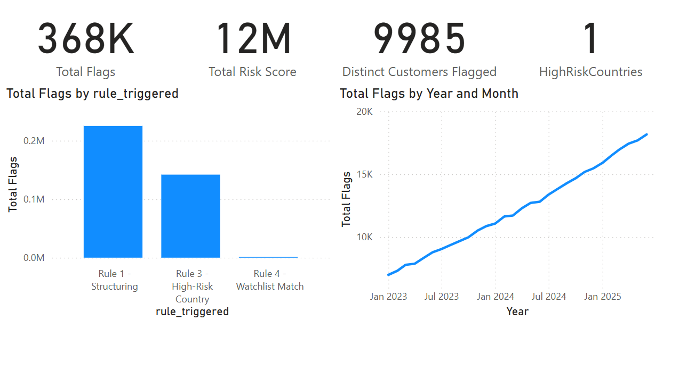

## 📊 Interactive Dashboard (Power BI)

This Power BI dashboard visualizes outputs from the AML pipeline and provides actionable insights for compliance teams, auditors, and analysts.

### 🧭 Key Pages

1. **Client Risk Overview**

   * Risk score distribution across flagged customers  
   * Top flagged clients by total risk score  

2. **Transaction Monitoring**

   * Filterable list of high-risk transactions by jurisdiction, channel, and transaction method  
   * Trends and patterns over time for suspicious activities  

3. **Case Summary**

   * Timeline of AML alerts and investigations  
   * Rule triggers per client  
   * SAR/CTR (Suspicious Activity Report / Currency Transaction Report) coverage  

### 🔌 Dataset Connection & Preparation

* Source database: **aml_simulation.db** (SQLite)  
* Due to limited native SQLite support in Power BI, data is **exported selectively** via SQL queries focusing on key risk fields, transactions, and customers.  
* Exported CSVs include a mapped **country_codes.csv** to resolve country abbreviations to full country names for geographical visualizations.  
* Connection to Power BI is established via CSV import or ODBC drivers (if configured).  

### 📊 Key DAX Measures

Click to view code

<pre class="overflow-x-auto bg-gray-800 text-green-400 p-4 rounded-md text-sm font-mono"><code class="DAX">
HighRiskCountries =
CALCULATE(
    DISTINCTCOUNT(flagged_txns_model[customer_country]),
    FILTER(
        flagged_txns_model,
        flagged_txns_model[customer_country] IN {"IR", "KP", "PA", "KY"}
    )
)

Total Risk Score =
SUMX(
    flagged_txns_model,
    SWITCH(
        TRUE(),
        flagged_txns_model[rule_triggered] = "Rule 1 - Structuring", 30,
        flagged_txns_model[rule_triggered] = "Rule 3 - High-Risk Country", 40,
        flagged_txns_model[rule_triggered] = "Rule 4 - Watchlist Match", 25,
        flagged_txns_model[rule_triggered] = "Rule 5 - Dormant Reactivation", 20,
        0
    )
)
</code></pre>

### 🧩 Dashboard Screenshot

